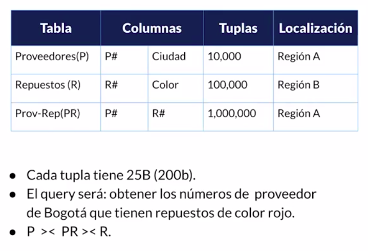
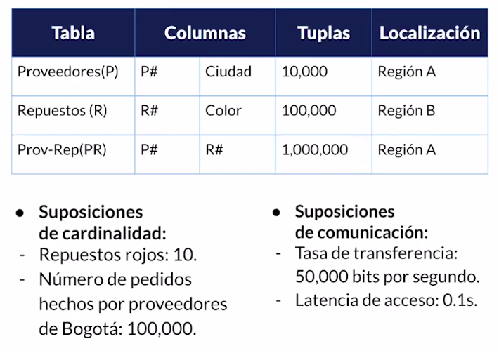
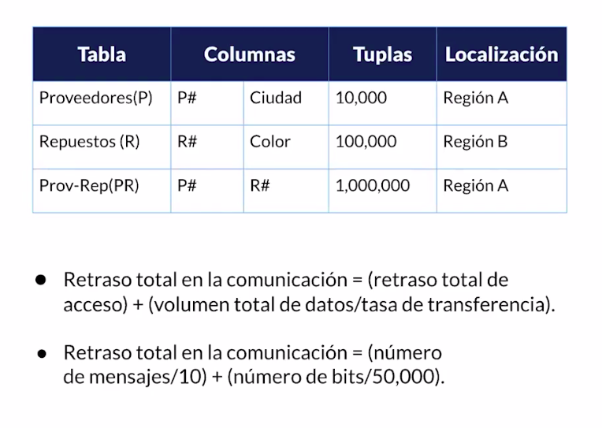
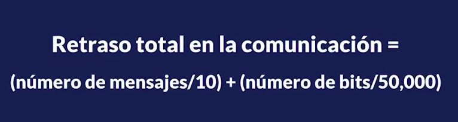
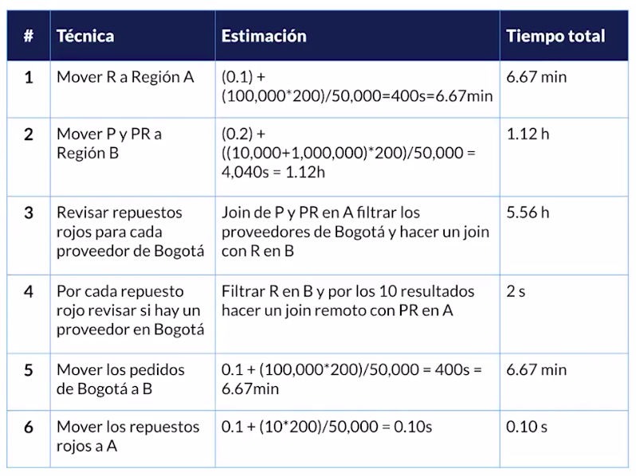

# Curso Práctico de SQL

## Configuraciones

Esta base de datos se propuso sobre docker, usando docker compose, a continuación algunas recomendaciones para generar el entorno de manera rápida.

## Usuario y contraseña

Se deben cambiar en las variables de entorno `PGADMIN_DEFAULT_EMAIL` y `PGADMIN_DEFAULT_PASSWORD`, dentro del docker-compose.yaml.

## Construir la imagen de docker para usar los servicios

```bash
docker-compose up -d
```

## Ver la ip de conexión a la BD

```bash
docker network inspect curso_sql_default
```

## Detener los servicios

```bash
docker-compose down
```

---

## Bases de datos Distribuidas

Colección de base de datos, una base de datos geográficamente distribuidos y conectados a través de una red informática.

### Ventajas

- Desarrollo modular.
- Incrementa la confiabilidad.
- Mejora el rendimiento.
- Mayor disponibilidad.
- Rapidez de respuesta.

### Desventajas

- Manejo de seguridad.
- Complejidad de procesamiento.
- Integridad de datos más compleja.
- Costo.

## Tipos

### Homogéneas

Mismo OS, Sistema de base de datos y modelos de datos. (Todo en linux, todas postgresql, etc.)

### Heterogéneas

No todos sus componentes son iguales en las particiones

## Arquitecturas

- Cliente - servidor
- Par a par (Peer to peer)
- Multi manejador de base de datos.

## Estrategias de diseño

- Top down | Configuraciones desde cero
- Botton up | Construir sobre lo construido

## Almacenamiento distribuido

- Fragmentación
- Replicación
- Distribución

## Fragmentación

- Horizontal (Sharding)
- Vertical (Columnar) ej: BigQuery
- Mixta | Combinación de las anteriores

## Replicación

- Completa
- Parcial
- Sin replicación

## Distribución de datos

- Centralizada
- Particionada
- Replicada

---

## Queries distribuídos











---

## Sharding

Técnica que se usa para partir la base de datos para realizar los queries de forma optimizada.


### Problemas

- Joins entre shards.
- Baja elasticidad
- Reemplaza PK

---

## Window Functions

Son cálculos en algunas tuplas que se encuentran relacionadas con la tupla actual.

Sirven para evitar el uso de self joins y reduce la complejidad alrededor de la analítica, agregaciones y el uso de cursores.

```sql
-- Ejercicio Window Functions

-- Por carrera
SELECT *,
	AVG(colegiatura) OVER (
	PARTITION BY carrera_id
	)
FROM platzi.alumnos

-- Por toda la tabla
SELECT *,
	AVG(colegiatura) OVER (

	)
FROM platzi.alumnos


-- Por carrera
SELECT *,
	SUM(colegiatura) OVER (
	PARTITION BY carrera_id
	ORDER BY colegiatura
	)
FROM platzi.alumnos

-- Usando una subquery para manejar WHERE en una columna obtenida a partir de una window function.
SELECT *
FROM(
	SELECT *,
	RANK() OVER (
	PARTITION BY carrera_id
	ORDER BY colegiatura DESC
	) AS brand_rank
FROM platzi.alumnos) AS ranked_colegiaturas_por_carrera
WHERE brand_rank > 3
ORDER BY brand_rank
```
