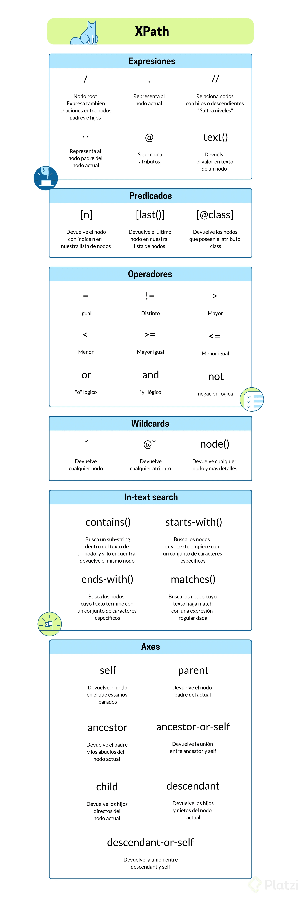

# Página para practicar

## Sandbox

https://toscrape.com/

### Quotes

https://quotes.toscrape.com/

</img>

## Proyecto del curso

Crear un scraper usando xpath. Se selecciona el periódico colombiano La República, como base para realizar el scraper

### Freelance links

https://www.workana.com/es
https://www.upwork.com/
